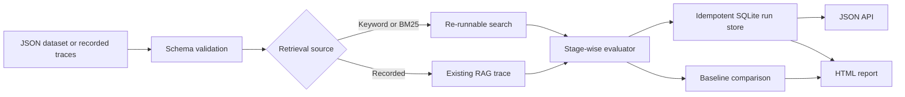

# RAG Failure Lab

**A runnable, inspectable RAG quality workbench.** It helps engineering teams tell whether a bad answer started in retrieval, source attribution, or answer construction. It accepts a labeled document-and-Q&A dataset or recorded retrieval traces, runs deterministic checks, stores results, and produces a shareable HTML report.

This repository uses **synthetic data only**. It needs no API key, cloud account, vector database, or paid model.

**Preview the outputs:** [baseline comparison report](docs/demo-report.html) · [captured-retrieval replay report](docs/replayed-report.html) · [fault-trace diagnosis report](docs/trace-report.html). These are standalone HTML files with an expandable case explorer.

No former employer or customer data is needed. The documents, questions, authored answers, and deliberate defects in this repository were created for this demo. The retrieval rankings in [`replayed-traces.json`](docs/replayed-traces.json) were then **captured by running the included BM25 retriever** against those documents; they are not invented production logs.

## See it work in two minutes

Python 3.10+ is the only runtime requirement. From the repository root:

```bash
# macOS / Linux
PYTHONPATH=src python -m rag_failure_lab evaluate --mode bm25 --top-k 1 --compare keyword --html docs/demo-report.html
PYTHONPATH=src python -m rag_failure_lab serve
```

```powershell
# Windows PowerShell
$env:PYTHONPATH = "src"
python -m rag_failure_lab evaluate --mode bm25 --top-k 1 --compare keyword --html docs/demo-report.html
python -m rag_failure_lab serve
```

Open `http://127.0.0.1:8080` for the interactive case explorer, or open [`docs/demo-report.html`](docs/demo-report.html) directly. The server binds to localhost by default.

Run the tests:

```bash
python -m unittest discover -s tests -v
```

## What the demo proves

The 12-case synthetic support dataset deliberately includes a wrong answer and a citation error. At **top 1**, simple keyword retrieval finds the gold source in 11/12 cases (91.7%); BM25 with a visible title signal finds it in 12/12 (100%). The candidate fixes one retrieval miss, introduces no retrieval regression, and still exposes the answer and citation defects. These results apply to the bundled sample, **not** to an unseen customer dataset.

The second synthetic fixture, [`recorded-traces.json`](src/rag_failure_lab/data/recorded-traces.json), demonstrates a more realistic integration: import the document IDs already returned by an existing RAG system. It contains one pass and one failure at each of the retrieval, citation, and answer stages.

To reproduce the captured rankings yourself:

```bash
PYTHONPATH=src python -m rag_failure_lab capture-traces --mode bm25 --top-k 1 --output docs/replayed-traces.json
PYTHONPATH=src python -m rag_failure_lab evaluate --dataset docs/replayed-traces.json --mode recorded --top-k 1 --html docs/replayed-report.html
```

The trace capture executes retrieval only; it does not run an LLM or claim that the authored answers were model-generated.

## Diagnostic stages

| Stage | Check | Typical action |
| --- | --- | --- |
| Retrieval | Fraction of labeled gold documents in top K; reciprocal rank | Inspect chunking, indexing, filters, reranking |
| Citation | Cited IDs must have been retrieved and include required sources | Fix source mapping and citation generation |
| Answer | Required answer terms must appear | Adjust context or answer construction |
| Evidence signal | Token overlap with cited documents | Queue low-support cases for human review |

The diagnosis follows that order, so one case gets one primary label. Every intermediate value is included in the JSON result. The lexical evidence signal is intentionally conservative and **is not a factuality or semantic correctness judge**. For real use, calibrate criteria against human labels and add a model-based judge only when its cost, privacy, and error profile are acceptable.

## Input contract

Each JSON dataset has `name`, `documents`, and `cases`. A case contains:

```json
{
  "id": "T02",
  "question": "When can I return unused hardware?",
  "answer": "Unused hardware can be returned within 14 days. [returns]",
  "expected_answer": "Within 14 days of delivery.",
  "required_doc_ids": ["returns"],
  "citations": ["returns"],
  "expected_terms": ["14 days"],
  "retrieved_doc_ids": ["warranty", "shipment"]
}
```

`retrieved_doc_ids` is required only for `--mode recorded`. It lets the workbench analyze a real system's trace without replacing that system's retriever. The demo tokenizer is English-oriented; multilingual and semantic checks are explicit future work.

Evaluate a trace file:

```bash
PYTHONPATH=src python -m rag_failure_lab evaluate \
  --dataset src/rag_failure_lab/data/recorded-traces.json \
  --mode recorded --top-k 2 --html docs/trace-report.html
```

For Windows, set `$env:PYTHONPATH = "src"` and put the command on one line.

## HTTP API

`python -m rag_failure_lab serve` starts a local, threaded HTTP server backed by SQLite. The API has a 2 MiB request cap; runs are content-addressed, so repeated submissions of the same dataset and settings reuse the same ID.

| Endpoint | Purpose |
| --- | --- |
| `GET /` | Demo report with baseline comparison |
| `GET /healthz` | Health check |
| `GET /api/runs` | Recent runs |
| `POST /api/runs` | Evaluate `{"dataset": {...}, "mode": "recorded", "top_k": 2}` |
| `GET /api/runs/{id}` | Full JSON results |
| `GET /api/runs/{id}/report` | Standalone HTML report |

The server has no authentication or multi-tenant isolation. Keep the default localhost bind for the demo; add authentication and data retention controls before hosting it for customers.

## Architecture



Implementation choices are documented in [`docs/architecture.md`](docs/architecture.md).

## What this portfolio project shows

- A failure taxonomy that separates retrieval from answer quality.
- Reproducible before/after evaluation with case-level regression visibility.
- A practical path to ingest an existing system's traces.
- Input validation, bounded API requests, local persistence, deterministic run IDs, and tests.
- An honest report that makes the limits of lexical checks visible.

It is an evaluation workbench, **not** a claim that a full production chatbot or a proprietary customer deployment has been built here. A production engagement would adapt the schema, metrics and integration to the client's stack and privacy requirements.

## Next engineering milestones

1. Add judge calibration against human-labeled groundedness and faithfulness cases.
2. Add retrieval adapters for common vector stores and rerankers, with trace sampling and PII redaction.
3. Add tenant isolation, authentication, retention policies, and background jobs for hosted operation.
4. Add a Go ingestion/API service once the portable core's contract is stable.

## License

MIT. See [`LICENSE`](LICENSE).
